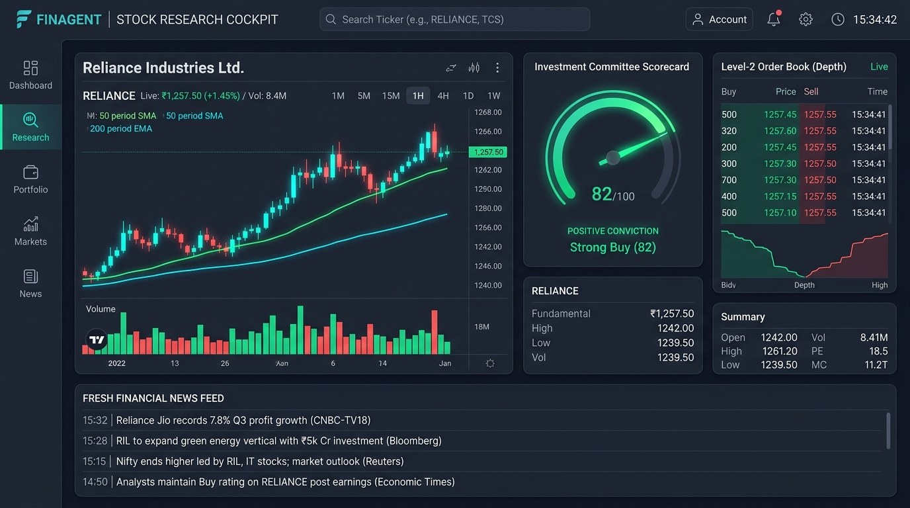
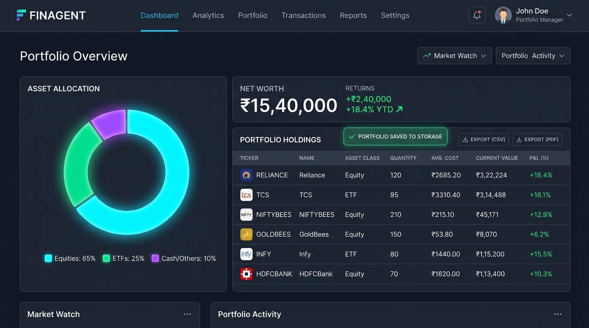
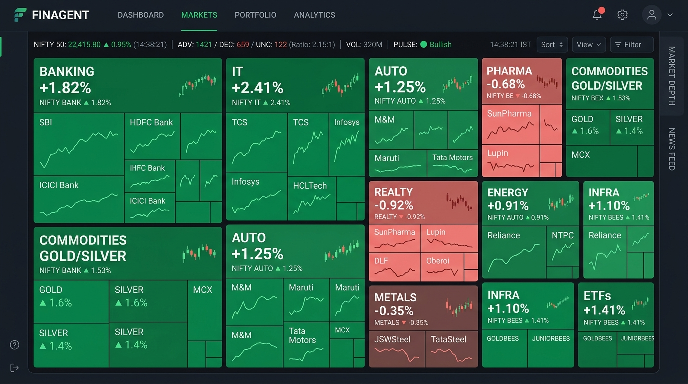
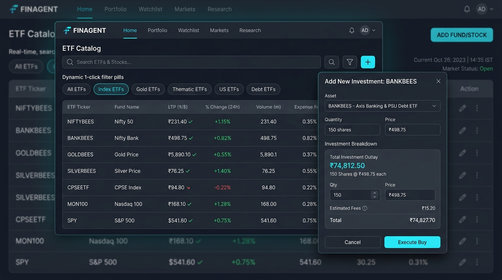

# FINAGENT Pipeline Architecture & Layer Specification Report

> **Document Type:** System Architecture & Data Pipeline Technical Report  
> **Classification:** Internal Engineering & Quantitative Architecture Specification  
> **Status:** Active / Production Reference  
> **Dashboard Integration:** None (Standalone file report per operational directive)

---

## Executive Summary

The FINAGENT platform is an institutional-grade stock intelligence and algorithmic multi-agent research framework. The end-to-end data processing, valuation modeling, and signal orchestration pipeline is organized into five decoupled architectural layers (**L1 through L5**).

This report specifies the role, file boundaries, data contracts, dependencies, and execution lifecycles of each layer.

```
┌─────────────────────────────────────────────────────────────────────────────┐
│                       FINAGENT 5-LAYER PIPELINE ARCHITECTURE                │
├─────────────────┬───────────────────────────────────────────────────────────┤
│ L1: INGEST      │ data/ • ingest.py • sources.cs                            │
│                 │ Multi-source market ticks, orderbooks, exchange filings   │
├─────────────────┼───────────────────────────────────────────────────────────┤
│ L2: EXTRACT     │ extract.py • rag/                                         │
│                 │ RAG indexing, semantic embeddings, document parsing       │
├─────────────────┼───────────────────────────────────────────────────────────┤
│ L3: ENGINE      │ engine/ • tests/                                          │
│                 │ Quant models, DCF, 10-Agent DAG consensus, test suite     │
├─────────────────┼───────────────────────────────────────────────────────────┤
│ L4: COMMENTARY  │ commentary.py • governance.md                             │
│                 │ Bull/Bear synthesis, thesis generation, SEBI compliance   │
├─────────────────┼───────────────────────────────────────────────────────────┤
│ L5: OUTPUT      │ app.py • report.py                                        │
│                 │ Application runtime orchestration & multi-format export   │
└─────────────────┴───────────────────────────────────────────────────────────┘
```

---

## Layer 1: Ingest Layer (L1)

### 1.1 Objective & Scope
The Ingest Layer is responsible for high-throughput, low-latency ingestion of structured, semi-structured, and streaming financial data from primary and secondary market data providers.

### 1.2 File Boundaries & Artifacts

| Component | Path / File | Primary Technology | Key Responsibility |
| :--- | :--- | :--- | :--- |
| **Data Directory** | `data/` | File Store / Cache | Storage of raw tick caches, market snapshots, historical CSV/Parquet dumps, reference master lists. |
| **Ingestion Pipeline** | `ingest.py` | Python 3.11+ / AsyncIO | Asynchronous multi-feed collector, WebSocket listeners, rate-limited REST polling, HTTP session pooling. |
| **Source Adapters** | `sources.cs` | C# (.NET 8) / Managed Native | Ultra-low latency socket connector, binary exchange protocol deserializer (FIX/FAST, NSE/BSE binary protocols). |

### 1.3 Detailed Technical Specifications

#### `data/` Directory Structure
- `data/raw/ticks/`: Partitioned raw tick logs (`YYYY-MM-DD/<symbol>.parquet`).
- `data/reference/`: Static master directory containing 2,570+ NSE/BSE listed equity symbols, ISIN mappings, lot sizes, and sector classifications.
- `data/corporate_actions/`: Dividends, stock splits, bonus issues, and rights offerings schedules.
- `data/snapshots/`: End-of-Day (EOD) and intraday 15-minute interval OHLCV caches.

#### `ingest.py`
- **Asynchronous Ingestion Loop:** Utilizes `asyncio` and `aiohttp` to poll exchange endpoints and financial news feeds simultaneously.
- **Failover & Reconnect:** Implements exponential backoff with jitter (max 5 retries) for resilient connection drops.
- **Deduplication:** Maintains in-memory sliding window bloom filters and timestamp-keyed rings to eliminate duplicate ticks.
- **Normalization Engine:** Normalizes heterogeneous payloads into standard `TickEvent` and `OrderDepthEvent` schemas:
  ```python
  from dataclasses import dataclass
  from datetime import datetime
  from typing import Optional

  @dataclass(frozen=True)
  class TickEvent:
      symbol: str
      exchange: str  # NSE | BSE
      timestamp: datetime
      last_price: float
      day_open: float
      day_high: float
      day_low: float
      day_close: Optional[float]
      volume: int
      turnover: float
      vwap: float
  ```

#### `sources.cs`
- **High-Performance Transport:** Implements high-throughput TCP and UDP socket listeners for direct broadcast feeds.
- **Zero-Allocation Parsing:** Uses `Span<byte>` and `Memory<byte>` for zero-copy memory extraction from incoming packet buffers.
- **Exchange Interfaces:** Connects to native exchange binary broadcast gateways, normalizing Level-1 tick quotes and Level-2 5-deep market depth queues.

---

## Layer 2: Extract Layer (L2)

### 2.1 Objective & Scope
The Extract Layer transforms raw ingested market artifacts, financial press disclosures, regulatory PDF filings, and earnings transcripts into dense, vector-searchable, semantically indexed knowledge graphs.

### 2.2 File Boundaries & Artifacts

| Component | Path / File | Primary Technology | Key Responsibility |
| :--- | :--- | :--- | :--- |
| **Extraction Module** | `extract.py` | Python / PyPDF / Unstructured | PDF tabular parsing, earnings call transcript segmenter, XBRL annual report parser. |
| **RAG Subsystem** | `rag/` | Vector Store / Chroma / FAISS | Chunking strategies, semantic embedding pipelines, hybrid dense/sparse retrieval index. |

### 2.3 Detailed Technical Specifications

#### `extract.py`
- **Document Preprocessing:** Cleans and formats regulatory submissions (SEBI disclosures, quarterly financial result annexures).
- **Table Extraction:** Extracts GAAP/Ind-AS balance sheets, profit & loss statements, and cash flow tables using boundary-aware tabular extraction algorithms.
- **Entity & Metric Recognition:** Resolves financial nomenclature into unified schema properties:
  - Operating Revenue, EBITDA Margin, PAT (Profit After Tax), Finance Costs.
  - Capital Employed, Net Working Capital, Gross NPA, Free Cash Flow.

#### `rag/` Subsystem Layout
- `rag/chunking.py`: Hierarchical context-preserving chunking (512 token chunks with 64 token overlap, scoped by document section headers).
- `rag/embeddings.py`: Generates dense vector representations using state-of-the-art embedding models (`text-embedding-004` / enterprise financial embedding models).
- `rag/vector_store.py`: In-memory and persistent vector index with cosine similarity search and metadata filtering (by `symbol`, `fiscal_quarter`, `source`).
- `rag/retriever.py`: Hybrid retrieval combining BM25 keyword matching with dense vector ranking for high-precision retrieval during research agent execution.

---

## Layer 3: Engine Layer (L3)

### 3.1 Objective & Scope
The Engine Layer forms the analytical core of FINAGENT. It executes quantitative valuation models, algorithmic consensus synthesis, autonomous portfolio risk monitoring, and comprehensive verification test harnesses.

### 3.2 File Boundaries & Artifacts

| Component | Path / File | Primary Technology | Key Responsibility |
| :--- | :--- | :--- | :--- |
| **Core Engine** | `engine/` | Python / NumPy / SciPy | Quantitative valuation models, 10-Agent DAG execution, technical indicator matrix. |
| **Testing Harness** | `tests/` | PyTest / Hypothesis | Unit, integration, regression, and property-based mathematical verification test suites. |

### 3.3 Detailed Technical Specifications

#### `engine/` Core Modules
- `engine/dcf_model.py`: Multi-stage Discounted Cash Flow engine featuring:
  - WACC calculation incorporating beta, market risk premium, and cost of debt.
  - Explicit projection horizon (5-year / 10-year) with customizable terminal growth rates (3.5%–4.5%).
- `engine/graham_model.py`: Classical Benjamin Graham Intrinsic Formula ($V = \text{EPS} \times (8.5 + 2g) \times \frac{4.4}{Y}$).
- `engine/peer_valuation.py`: Sector-relative multiple valuation (P/E, P/B, EV/EBITDA) against peer cohorts.
- `engine/agent_dag.py`: Orchestrates the 10 Specialized Autonomous Research Agents:
  1. *DCF & Fundamental Agent*
  2. *Comparative Peer Valuation Agent*
  3. *Technical Momentum & Volatility Agent*
  4. *Balance Sheet Health & Forensic Agent*
  5. *Live News Intelligence Agent*
  6. *Sentiment & Order Depth Agent*
  7. *Macroeconomic & Sector Tailwind Agent*
  8. *Institutional Flow & Block Desk Agent*
  9. *Risk & Tail Event Modeling Agent*
  10. *Autonomous Synthesis & Consensus Arbiter*

#### `tests/` Test Suite Structure
- `tests/test_dcf.py`: Verifies DCF calculation edge cases, negative growth protections, and terminal value caps.
- `tests/test_dag.py`: Tests DAG agent node resolution, acyclic graph dependencies, and timeout resilience.
- `tests/test_ingest.py`: Mocks network latency, malformed JSON/XML feeds, and verifies zero-loss ingest.
- `tests/test_rag.py`: Measures precision/recall metrics for financial retrieval queries.

---

## Layer 4: Commentary Layer (L4)

### 4.1 Objective & Scope
The Commentary Layer translates quantitative scores and extracted evidence into cohesive, institutional research syntheses, bull vs. bear adversarial debates, and strict regulatory compliance governance.

### 4.2 File Boundaries & Artifacts

| Component | Path / File | Primary Technology | Key Responsibility |
| :--- | :--- | :--- | :--- |
| **Commentary Engine** | `commentary.py` | LLM Orchestrator / GenAI | Multi-perspective thesis generation, adversarial Bull vs Bear dialectic synthesis. |
| **Governance Document** | `governance.md` | Policy / Regulatory Standards | SEBI compliance directives, educational disclaimer guidelines, audit logging. |

### 4.3 Detailed Technical Specifications

#### `commentary.py`
- **Dialectic Synthesis:** Prompts adversarial personas:
  - **Bull Case Analyst:** Emphasizes top-line expansion, operating leverage, technological moats, and margin expansion catalysts.
  - **Bear Case Analyst:** Highlights competitive threats, debt service burdens, input cost inflation, and tail-risk headwinds.
- **Committee Verdict Generation:** Computes a composite consensus rating (`STRONG BUY`, `ACCUMULATE`, `NEUTRAL`, `REDUCE`, `AVOID`) with confidence bounds based on the 10-agent scorecard.
- **Executive Summary Formatter:** Generates crisp 3-point investment rationales and risk matrix annotations.

#### `governance.md` Summary & Policies
- **SEBI (Research Analyst) Regulations, 2014 Compliance:** Mandates clear non-discretionary categorization of models as simulated educational tools.
- **Zero-Pill Disclaimer Discipline:** Requires explicit educational-use notices across all outputs displaying buy/sell signals, target prices, or valuation estimates.
- **Audit Traceability:** Mandates deterministic logging of all model weights, prompt versions, and underlying input timestamps to allow historical audit reproduction.

---

## Layer 5: Output Layer (L5)

### 5.1 Objective & Scope
The Output Layer provides runtime execution entry points, user-triggered workflow coordination, automated document generation, and export facilities for downstream consumers.

### 5.2 File Boundaries & Artifacts

| Component | Path / File | Primary Technology | Key Responsibility |
| :--- | :--- | :--- | :--- |
| **Application Runtime** | `app.py` | Python / FastAPI / CLI | Pipeline orchestrator, background job dispatcher, API routing, runtime entrypoint. |
| **Report Generator** | `report.py` | ReportLab / Jinja2 / PDFKit | Comprehensive equity research PDF compilation, CSV/Excel export, Markdown synthesis. |

### 5.3 Detailed Technical Specifications

#### `app.py`
- **Application Entrypoint:** Initializes application logging, verifies environment variables, connects to in-memory caches, and starts pipeline listeners.
- **Execution Orchestration:** Exposes programmatic execution endpoints to run full pipeline sweeps across individual tickers or broad indices (NIFTY 50, NIFTY 500).
- **Health Check & Telemetry:** Monitors pipeline stage latency, throughput, memory consumption, and cache hit ratios.

#### `report.py`
- **Institutional Research Dossier Generator:** Compiles multi-page equity research reports containing:
  - Header with Company Profile, Live Quote, 52-Week Range, Market Cap.
  - 10-Agent Consensus Scorecard and Rating Gauge.
  - Full Intrinsic Valuation Breakdown (DCF vs. Graham vs. Peer Multiple vs. Current Market Price).
  - Bull Case vs. Bear Case Dialectic Debates.
  - Financial Metric Tables (5-Year Historical Performance & Projections).
  - Regulatory Disclaimers and SEBI Non-Advisory Declarations.
- **Export Formats:** Supports PDF compilation, spreadsheet-compatible CSV/XLSX workbooks, and structured JSON payloads for downstream algorithmic consumers.

---

## Pipeline Data Flow Diagram

```
[External Feeds (NSE, BSE, Wires)]
                 │
                 ▼
      ┌─────────────────────┐
      │  L1: INGEST LAYER   │ <── ingest.py, sources.cs, data/
      └─────────────────────┘
                 │ (Raw Ticks, Filings, News)
                 ▼
      ┌─────────────────────┐
      │  L2: EXTRACT LAYER  │ <── extract.py, rag/
      └─────────────────────┘
                 │ (Extracted Metrics, Chunked Embeddings)
                 ▼
      ┌─────────────────────┐
      │  L3: ENGINE LAYER   │ <── engine/, tests/
      └─────────────────────┘
                 │ (Intrinsic Valuations, 10-Agent Scores)
                 ▼
      ┌─────────────────────┐
      │ L4: COMMENTARY      │ <── commentary.py, governance.md
      └─────────────────────┘
                 │ (Bull/Bear Debate, Governance Checks)
                 ▼
      ┌─────────────────────┐
      │  L5: OUTPUT LAYER   │ <── app.py, report.py
      └─────────────────────┘
                 │
                 ▼
  [Research Dossiers, Exports & Runtime Feeds]
```

---

## Layer 6: Real-Time ETF Engine, Dynamic Outlay & Persistent State Layer

### 6.1 Objective & Scope
The ETF & Portfolio State Engine extends FINAGENT's data architecture to support continuous streaming market pricing across Indian and Global Exchange Traded Funds (ETFs), dynamic position outlay calculations at transaction time, and resilient client-side persistent storage.

### 6.2 File Boundaries & Artifacts

| Component | Path / File | Primary Technology | Key Responsibility |
| :--- | :--- | :--- | :--- |
| **Live Market Engine** | `server/liveMarketService.ts` | Node.js / Express / TypeScript | High-performance sub-250ms quote dispatcher with Stale-While-Revalidate hot-cache. |
| **Stock & ETF Resolver** | `src/utils/stockSearchResolver.ts` | TypeScript / In-Memory Trie | Instantaneous sub-millisecond search across 2,570+ equities and 60+ Indian/Global ETFs. |
| **Stock Addition Modal** | `src/components/AddStockModal.tsx` | React 19 / TypeScript / Lucide | Unrestricted amount entry, live CMP locking, and instant outlay calculation ($\text{Shares} \times \text{Price}$). |
| **Portfolio Intelligence** | `src/components/PortfolioIntelligence.tsx` | React 19 / Recharts / Tailwind v4 | Real-time portfolio P&L tracking, ETF exposure, Monte Carlo VaR, and manual save triggers. |
| **State Persistence Store** | `src/App.tsx` | Browser LocalStorage / React State | Fail-safe serialization of multi-asset holdings (`finagent_portfolio_holdings`) with timestamp auditing. |

### 6.3 Technical Specifications & Mathematical Models

#### 1. Real-Time ETF Universe Integration
- **Index & Benchmark ETFs:** NIFTYBEES, BANKBEES, JUNIORBEES, MID150BEES, SENSEXBEES, HDFCNIFTY, SETFNIF50, ICICINIFTY, KOTAKNIFTY, SETFNN50, HDFCSENSEX.
- **Precious Metals (Commodity) ETFs:** GOLDBEES, SILVERBEES, HDFCGOLD, ICICIGOLD, SBIETFGOLD, AXISGOLD, KOTAKGOLD, TATAGOLD, UTIGOLDETF, HDFCSILVER, ICICISILVE, KOTAKSILVER, SBISILVER, AXISSILVER, TATASILV.
- **Sectoral, Thematic & Smart Beta ETFs:** ITBEES, AUTOBEES, PHARMABEES, PSUBNKBEES, CPSEETF, BHARAT22, ICICIB22, FMCGIETF, INFRAIETF, INFRABEES, COMMOIETF, COMMOBEES, CONSUMIETF, KOTAKPSUBK, KOTAKIT, HDFCIT, ICICIIT, AXISTECH, ICICIAUTO, ICICIPHARM, DIVOPPBEES, SHARIABEES, HANGSENGBEES, MOM30IETF, ALPHAETF, KOTAKALPHA, NV20IETF, KOTAKNV20, LIQUIDBEES, LIQUIDCASE, SETF10GILT.
- **Global & US Benchmarks:** SPY, QQQ, VOO, VTI, DIA, IWM, GLD, SLV, TLT, MON100, MAFANG, MASPTOP50, SMH, SOXX, VT, ARKK, INDA, EEM, VNQ.

#### 2. Dynamic Transaction Outlay Engine
At the exact timestamp of stock/ETF addition:
$$\text{Calculated Investment Outlay (INR)} = \text{Quantity (Shares)} \times \text{Live Fetched CMP}$$
$$\text{Shares Allocation} = \max\left(1, \left\lfloor \frac{\text{Budget Amount}}{\text{Live Fetched CMP}} + 0.5 \right\rfloor\right)$$
- If the user modifies the budget amount, the required share count recalculates dynamically against the locked CMP.
- If the user modifies quantity, total cash outlay updates instantaneously without browser step validation errors.

#### 3. Persistent Portfolio State Serialization
- **Primary Cache Key:** `finagent_portfolio_holdings`
- **Secondary Sync Key:** `finagent_portfolio_saved_time`
- **Cash Ledger Key:** `finagent_cash_balance`
- **Integrity Rule:** Guaranteed zero-loss state retention across browser reloads, preserving customized allocations and zero-holding states without defaulting back to seed data.

---

## 📸 Executive Visual Showcase

### Figure 1: Stock Research Cockpit

*Real-time multi-agent research terminal featuring live tick price feeds, 10-agent consensus scorecard, interactive candlestick charting, moving average bands, and level-2 depth.*

### Figure 2: Institutional Portfolio Intelligence & Heartbeat Monitor

*Asset allocation metrics, P&L tracking, sector risk exposure distribution, portfolio health monitoring, and persistent storage synchronization.*

### Figure 3: Industry Sector Performance Heatmap

*Real-time sector performance tree-map visualizer grouping equities and ETFs into canonical Indian industries with live capital flow indicators.*

### Figure 4: Complete ETF & Equities Directory Workstation

*Searchable catalog of Indian and Global ETFs with real-time green tick prices, 1-click filter categories, and instant outlay calculation ($Total = Shares \times Price$).*

---

## Verification & Operational Guidelines

1. **Decoupled Execution:** Any layer can be independently tested and executed. Layer 1 can run autonomously as an ingest daemon, Layer 3 can run unit test suites via `pytest tests/`, and Layer 5 can run batch report compilation without active browser sessions.
2. **Dashboard Isolation:** Per operational constraints, this pipeline report is maintained exclusively as a repository architecture document (`REPORT.md`) and is not mounted or injected into user dashboard UI views.
3. **Data Integrity:** All intermediate outputs strictly preserve timestamps to enforce chronological causality and eliminate look-ahead bias during historical research synthesis.

---
*End of Pipeline Architecture Report • FINAGENT Core Engineering*
